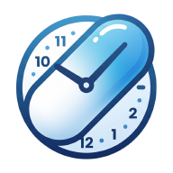
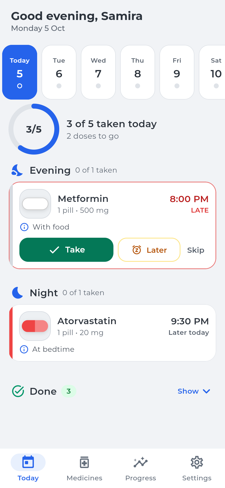
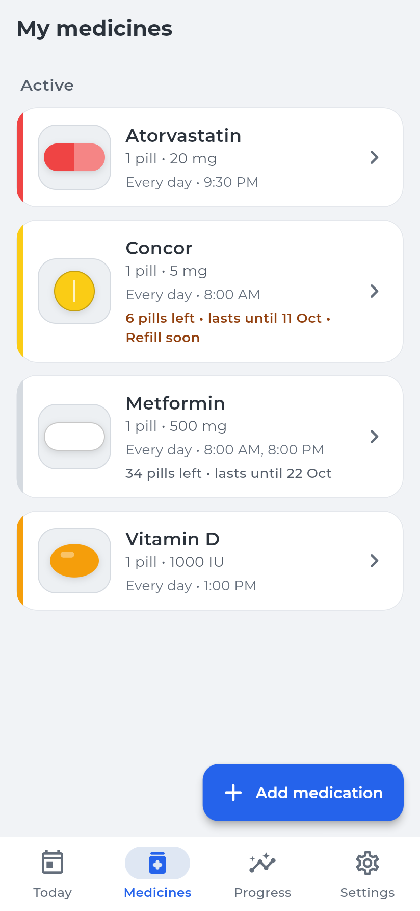
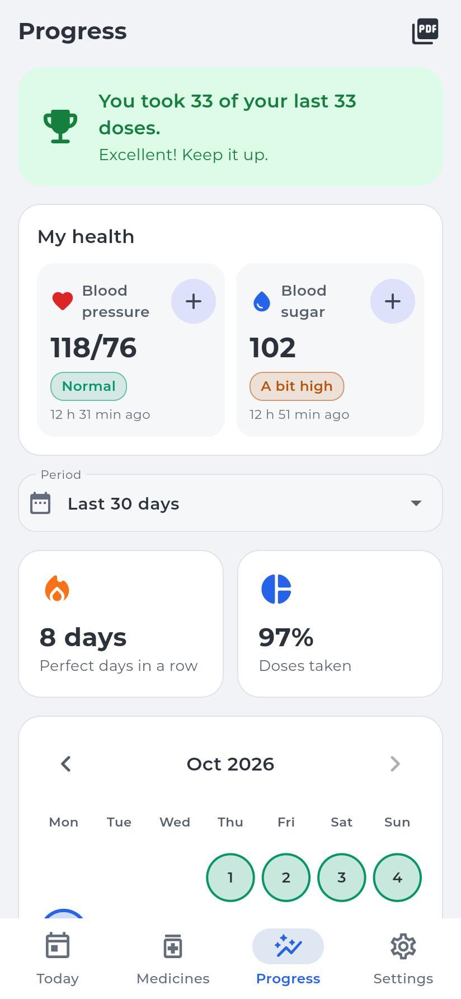
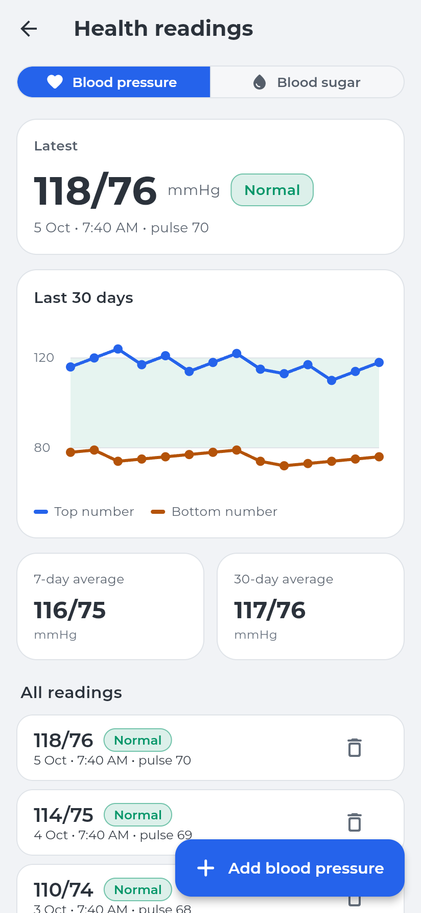
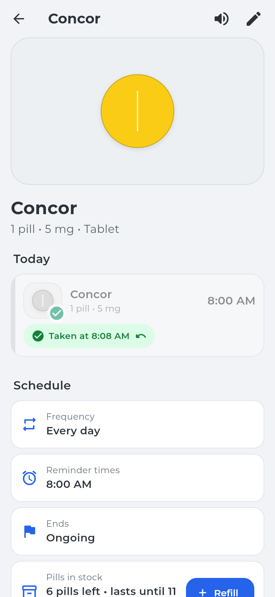
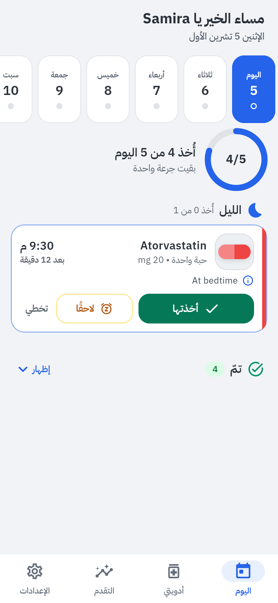
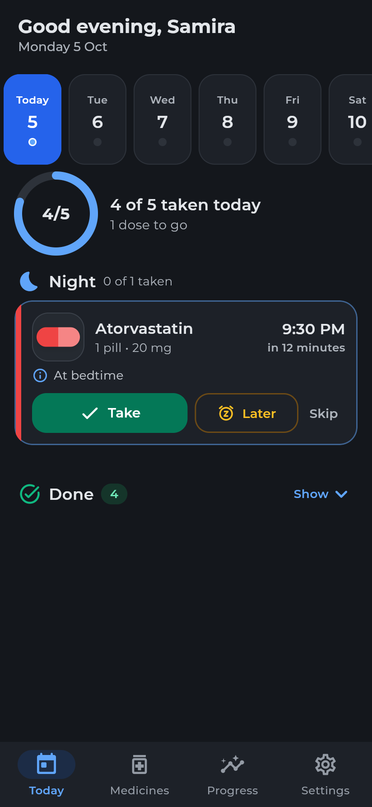

<div align="center">



# Dawaii · دوائي

**Medication reminders made simple, for older adults, in English and Arabic.**

[](https://github.com/AdamMaatouk/dawaii/actions/workflows/ci.yml)


**[⬇ Download for Android](https://github.com/AdamMaatouk/dawaii/releases/latest)** · iPhone coming later

</div>

Dawaii (Arabic for "my medicine") reminds you when it is time to take each medication, lets you log it with one tap, and shows how well you are keeping up. It was built for an older family member, so every screen is designed around large text, clear wording and forgiving interactions. Everything stays on the phone: no account, no server, no tracking.

<p align="center">
  
  
  
  
</p>
<p align="center">
  
  
  
</p>

## Features

**Reminders you can rely on**
- Reminders keep coming as long as a medication is active, with an optional "keep ringing until I answer" mode.
- **Take**, **Later** and **Skip** work right from the notification, without opening the app.
- The medication's photo appears in the notification, and the app can read the dose out loud.

**A calm daily view**
- Today's doses are grouped into morning, afternoon, evening and night. What is due or late comes first, and taken doses fold away.
- A progress ring for the day and a two-week calendar with a status dot for each day.
- Important actions ask for confirmation, and an accidental tap can be undone. A dose taken earlier can be logged at its real time.

**Medications**
- Shape, color and photo, so each pill is easy to recognise.
- Every day, specific weekdays or every N days. Ongoing or for a set period. Pause and resume.
- Pill stock that counts down with each dose, warns before it runs out, and refills in one tap.

**Health and progress**
- Blood pressure and blood sugar logs with 30-day charts, averages and plain-language ranges.
- Streaks, adherence and a month calendar. Missed doses are counted honestly, never hidden.
- A 30-day PDF report for the doctor, in English or Arabic.

**Built for older adults**
- Three text sizes on top of the phone's own setting. Big tap targets everywhere.
- Simple mode: only today's medications, with larger cards.
- Full Arabic with a right-to-left layout and correct Arabic plurals.
- Light, dark or same-as-phone theme, with readable contrast throughout.
- A short first-run setup that explains reminders before asking for permission.

**Private by design**
- No account, no analytics, no ads. The Android app does not even request internet access.
- Backups are a file you save and restore yourself.

## How it works

The app is organised around a few pure, well-tested services. The UI and the notification buttons both go through the same action layer, so the two can never disagree.

```
lib/
├── models/        PillModel, doses, health readings
├── services/
│   ├── schedule_service.dart   which doses are due, taken, late or missed (pure)
│   ├── reminder_planner.dart   picks the next reminders within OS limits (pure)
│   ├── day_planner.dart        groups a day into parts and sections (pure)
│   ├── dose_actions.dart       every change: take, skip, snooze, undo, refill
│   ├── notification_service.dart  books reminders, handles notification buttons
│   ├── storage_service.dart    local storage with migrations
│   └── report_service.dart     the PDF report
├── screens/       Today, Medicines, Progress, Settings, onboarding
├── widgets/       shared UI (time picker, dialogs, pill visuals)
└── l10n/          English and Arabic strings
```

A few decisions worth noting:

- **Reminders are planned, not repeated.** Android and iOS cap how many notifications an app can schedule (iOS allows 64). Instead of open-ended repeats, a planner books the soonest doses across all medications within that budget, up to 14 days ahead, and tops up every time the app opens. If the phone goes too long without opening Dawaii, a final reminder asks the user to open it.
- **"Missed" is derived, never stored.** A dose's state comes from its schedule and the clock, so there is no stale data to clean up, and editing a schedule never marks older days as missed.
- **Safe concurrent writes.** Notification buttons run in a background isolate while the app may also be open. Each dose is stored under its own key, so the two never overwrite each other.
- **Arabic everywhere.** That includes the PDF: any line containing Arabic is laid out right to left with an Arabic font, even inside an English report.

## Tech stack

Flutter and Dart, `flutter_local_notifications` (exact alarms, notification actions, alarm channel), `timezone`, `shared_preferences`, `pdf` and `printing`, `flutter_tts`, `image_picker`, `share_plus`, `file_picker`, and Flutter's `gen_l10n` with ICU plurals.

## Getting started

Requires Flutter 3.47 or newer.

```bash
flutter pub get
flutter run            # on a connected phone or emulator
flutter test           # 84 unit and widget tests
flutter analyze
```

`flutter run -d chrome` shows the UI in a browser. Notifications and photos only work on a real device.

Strings live in `lib/l10n/app_en.arb` and `lib/l10n/app_ar.arb` and are generated automatically. Every new string goes in both files.

### Release builds (Android)

Release builds are signed with a key that stays outside the repository. Create a keystore once and keep a backup of it:

```bash
keytool -genkey -v -keystore ~/dawaii-release.jks -keyalg RSA -keysize 2048 -validity 10000 -alias dawaii
```

Then create `android/key.properties`, which git ignores:

```properties
storeFile=/path/to/dawaii-release.jks
storePassword=...
keyAlias=dawaii
keyPassword=...
```

```bash
flutter build apk --release        # or: flutter build appbundle
```

Without `key.properties`, release builds fall back to the debug key, which is fine for testing.

## Privacy

Dawaii stores everything on the device and sends nothing anywhere. See [PRIVACY.md](PRIVACY.md).

Dawaii is a reminder tool, not medical advice. Always follow your doctor's instructions.

## Roadmap

- Caregiver alerts when a dose is missed (needs an optional, privacy-respecting backend)
- Arabic system permission prompts on iOS
- Home-screen widget for today's doses

## Credits

Created by **Adam Maatouk**. Developed with the help of AI coding assistants.

Fonts: [Montserrat](https://github.com/JulietaUla/Montserrat) by Julieta Ulanovsky and [IBM Plex Sans Arabic](https://github.com/IBM/plex) by IBM, both under the SIL Open Font License.

## License

Copyright © 2026 Adam Maatouk. All rights reserved. See [LICENSE](LICENSE).
